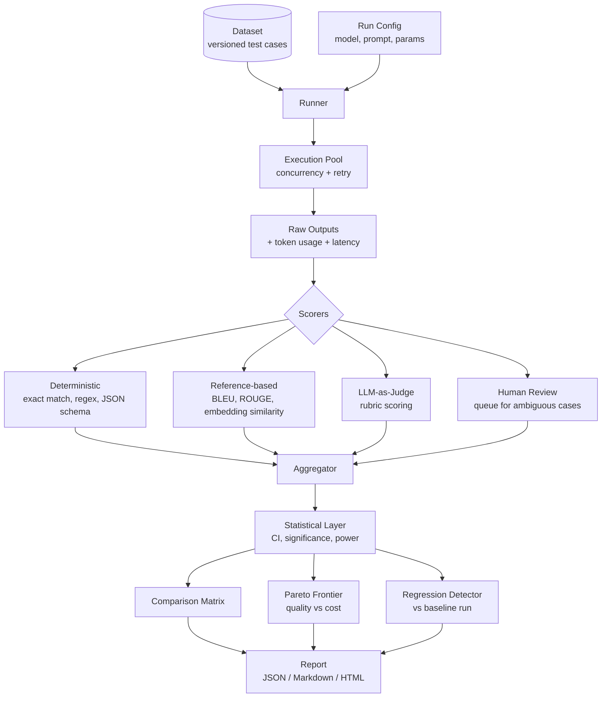
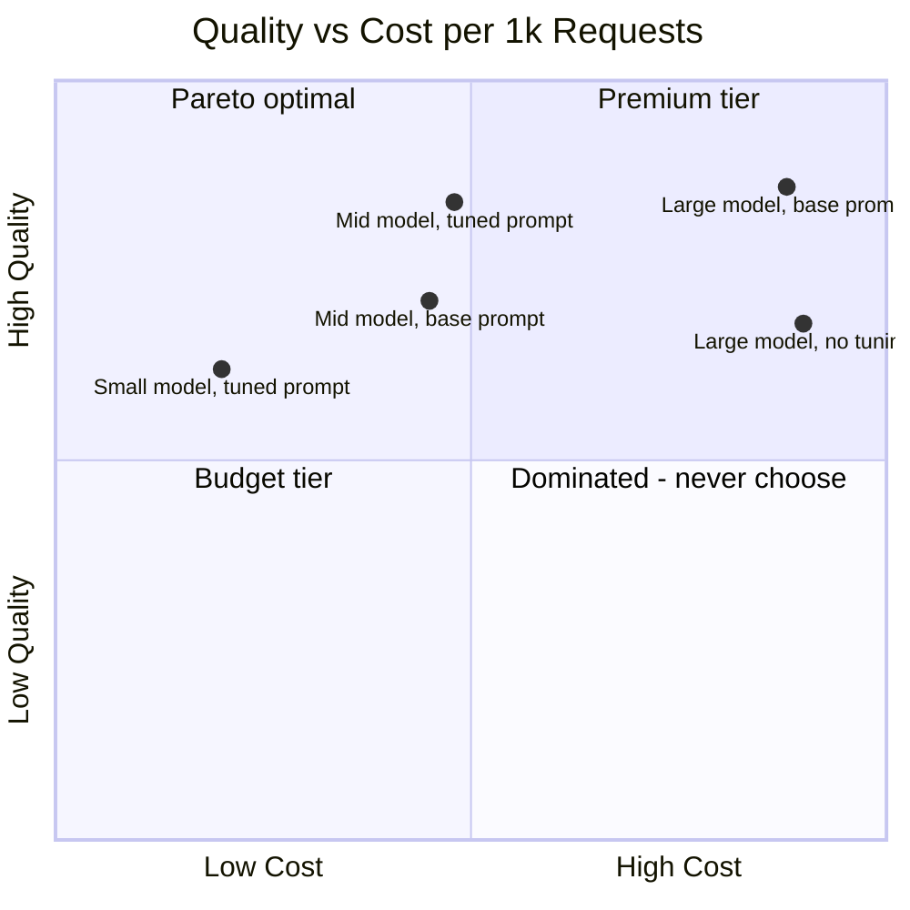

# eval-harness

> LLM evaluation framework: automated benchmarks, LLM-as-judge scoring, human-in-the-loop review, regression detection with statistical significance, and Pareto cost-quality analysis.

[](https://www.typescriptlang.org/)
[](https://nodejs.org/)
[](LICENSE)
[](#project-status)

## Project Status

**Work in progress.** The evaluation runner, scorer interfaces, statistical significance testing, and Pareto analysis are implemented. Provider adapters and the web report UI are in development. This repository is a framework, not a leaderboard: it ships no benchmark results of its own.

## Problem

Most teams "evaluate" their LLM changes by trying a few prompts by hand and forming an impression. That approach fails in specific, predictable ways:

- **Vibes are not measurements.** You cannot tell a 3% regression from noise by reading ten outputs.
- **Sample sizes are too small to conclude anything.** Comparing two models on 20 examples has no statistical power, yet decisions get made on it anyway.
- **Cost is ignored in quality decisions.** A model that is 2% better and 8x more expensive is usually the wrong choice, but nobody computes the trade-off.
- **Regressions ship silently.** A prompt tweak that helps one case and breaks fifteen others looks like an improvement if you only check the one case.

This harness makes evaluation a deterministic, repeatable, statistically honest pipeline.

## Architecture



## Core Concepts

### Scorer Taxonomy

| Type | Determinism | Cost | Use When |
|------|-------------|------|----------|
| **Deterministic** | Fully deterministic | Free | There is exactly one correct answer: classification, extraction, JSON structure |
| **Reference-based** | Deterministic given references | Free to cheap | You have gold outputs and care about surface or semantic similarity |
| **LLM-as-judge** | Stochastic, needs calibration | Per-call token cost | Open-ended quality: helpfulness, tone, reasoning soundness |
| **Human** | Authoritative, slow | Expensive | Calibrating judges, resolving disagreement, high-stakes decisions |

A well-designed suite uses deterministic scorers wherever possible and reserves judges for what genuinely cannot be checked mechanically. Judges are the expensive, noisy part of the pipeline, not the default.

### Statistical Significance

Comparing two runs requires more than comparing two means. The harness reports:

**Bootstrap confidence intervals.** Resample the per-example scores with replacement `N` times (default 10,000), take the percentile interval. This makes no distributional assumption, which matters because LLM score distributions are usually not normal, often bimodal, and frequently bounded.

**Paired comparison.** When two models run over the same dataset, the samples are paired. Paired tests are far more sensitive than unpaired ones, because per-example difficulty variance cancels out.

**Minimum detectable effect.** Before you run, the harness tells you what effect size your dataset can actually detect at the configured power. If you want to detect a 1% difference and your dataset supports 8%, you learn that first instead of drawing a false conclusion afterward.

```
Approximate paired sample size for detecting difference d:

    n ≈ ( (z_{α/2} + z_β)² · σ_diff² ) / d²

where σ_diff is the standard deviation of per-example score differences.
```

This is why the harness refuses to print a bare "Model A is better." It prints an effect size with an interval, and whether that interval crosses zero.

### Pareto Cost-Quality Analysis

A configuration is **Pareto-dominated** if another configuration is at least as good on quality *and* at least as cheap, and strictly better on at least one. Dominated options should never be chosen, and the harness eliminates them automatically.



The interesting output is not "which is best" but the frontier itself: the set of configurations where buying more quality genuinely requires spending more money.

### Regression Detection

Every run can be compared against a stored baseline. The detector distinguishes three cases that naive diffing conflates:

1. **Aggregate regression** — mean score dropped, significantly.
2. **Per-example regression** — mean held or improved, but specific examples broke. This is the dangerous case that averages hide.
3. **Noise** — difference is within the confidence interval, no action needed.

## Installation

```bash
npm install @q1-digital/eval-harness
```

## Quick Start

```typescript
import {
  EvalHarness,
  ExactMatchScorer,
  JSONSchemaScorer,
  LLMJudgeScorer,
} from '@q1-digital/eval-harness';
import { z } from 'zod';

const harness = new EvalHarness({
  dataset: {
    path: './datasets/support-classification.jsonl',
    version: 'v3',
  },
  concurrency: 8,
  retry: { maxAttempts: 3, backoffMs: 1000 },
  statistics: {
    bootstrapIterations: 10_000,
    confidenceLevel: 0.95,
    power: 0.8,
  },
});

harness.addScorer(new ExactMatchScorer({ field: 'category', weight: 0.5 }));

harness.addScorer(new JSONSchemaScorer({
  schema: z.object({
    category: z.enum(['billing', 'technical', 'account']),
    urgency: z.number().int().min(1).max(5),
  }),
  weight: 0.2,
}));

harness.addScorer(new LLMJudgeScorer({
  model: 'gpt-4o-mini',
  rubric: `
    Rate the reasoning quality from 1-5:
    5 = correct category with clear, specific justification
    3 = correct category, vague justification
    1 = wrong category or no justification
  `,
  weight: 0.3,
  calibrationSet: './datasets/judge-calibration.jsonl',
}));

const run = await harness.run({
  id: 'sonnet-tuned-prompt',
  model: 'claude-sonnet-4-20250514',
  promptTemplate: './prompts/classify.v4.md',
  params: { temperature: 0, maxTokens: 512 },
});

console.log(run.score.mean);              // 0.847
console.log(run.score.confidenceInterval); // [0.821, 0.872]
console.log(run.cost.totalUSD);           // 1.34
console.log(run.latency.p95);             // 1_240
```

### Comparing Configurations

```typescript
const comparison = await harness.compare([
  { id: 'haiku-v4',  model: 'claude-haiku-4-20250514',  promptTemplate: './prompts/classify.v4.md' },
  { id: 'sonnet-v4', model: 'claude-sonnet-4-20250514', promptTemplate: './prompts/classify.v4.md' },
  { id: 'mini-v4',   model: 'gpt-4o-mini',              promptTemplate: './prompts/classify.v4.md' },
]);

console.log(comparison.matrix);
// Pairwise: effect size, CI, p-value, significant (bool)

console.log(comparison.paretoFrontier);
// Only non-dominated configs, with what each extra dollar buys

console.log(comparison.recommendation);
// { configId, rationale, tradeoff } — explicit about what is being traded
```

### Regression Gate in CI

```typescript
const regression = await harness.detectRegression({
  candidate: run,
  baseline: await harness.loadRun('sonnet-tuned-prompt@v3'),
});

if (regression.aggregateRegression?.significant) {
  throw new Error(
    `Score dropped ${regression.aggregateRegression.delta} ` +
    `(CI ${regression.aggregateRegression.confidenceInterval})`,
  );
}

if (regression.perExampleRegressions.length > 0) {
  console.warn(`${regression.perExampleRegressions.length} examples regressed:`);
  for (const ex of regression.perExampleRegressions) {
    console.warn(`  ${ex.exampleId}: ${ex.baselineScore} -> ${ex.candidateScore}`);
  }
}
```

### Checking Statistical Power Before Running

```typescript
const power = harness.analyzePower({
  datasetSize: 240,
  expectedStdDev: 0.18,
});

console.log(power.minimumDetectableEffect); // 0.046
// "This dataset can detect a 4.6% difference at 80% power.
//  It cannot resolve anything smaller. Add examples or accept coarser resolution."
```

## Dataset Format

JSONL, one test case per line. Versioned so runs remain comparable.

```jsonl
{"id":"tc_001","input":{"message":"I was charged twice this month"},"expected":{"category":"billing","urgency":4},"tags":["billing","duplicate-charge"]}
{"id":"tc_002","input":{"message":"How do I reset my password?"},"expected":{"category":"account","urgency":2},"tags":["account","self-service"]}
```

Tags enable slice analysis: overall score can hold steady while a specific slice collapses, and slicing is how you catch it.

## Project Structure

```
src/
├── core/
│   ├── harness.ts                  # Orchestrator: run, compare, detectRegression
│   ├── runner.ts                   # Concurrency pool, retry, progress
│   ├── dataset.ts                  # JSONL loading, versioning, slicing
│   └── config.ts                   # Zod schemas
├── scorers/
│   ├── base.scorer.ts              # Scorer interface
│   ├── deterministic/
│   │   ├── exact-match.scorer.ts
│   │   ├── regex.scorer.ts
│   │   └── json-schema.scorer.ts
│   ├── reference/
│   │   ├── bleu.scorer.ts
│   │   ├── rouge.scorer.ts
│   │   └── embedding-similarity.scorer.ts
│   ├── judge/
│   │   ├── llm-judge.scorer.ts       # Rubric-based scoring
│   │   └── calibration.ts            # Agreement vs human labels
│   └── human/
│       └── review-queue.ts           # Ambiguous-case routing
├── statistics/
│   ├── bootstrap.ts                # Percentile CIs via resampling
│   ├── significance.ts             # Paired tests, effect size
│   ├── power.ts                    # Minimum detectable effect
│   └── pareto.ts                   # Frontier computation
├── analysis/
│   ├── comparison-matrix.ts        # Pairwise config comparison
│   ├── regression-detector.ts      # Aggregate + per-example
│   └── slice-analysis.ts           # Per-tag breakdown
├── reporting/
│   ├── json.reporter.ts
│   ├── markdown.reporter.ts
│   └── html.reporter.ts
└── index.ts
```

## Design Decisions

**Why bootstrap instead of a t-test?** The t-test assumes approximately normal sampling distributions. LLM scores are frequently bounded in `[0,1]`, bimodal (mostly right or mostly wrong), and skewed. Bootstrapping makes no such assumption and degrades gracefully when the distribution is ugly.

**Why require judge calibration?** An uncalibrated LLM judge produces confident numbers with unknown validity. Measuring judge-human agreement on a calibration set turns the judge from an oracle into an instrument with a known error rate. If agreement is poor, the judge's scores should not drive decisions.

**Why report per-example regressions separately from the mean?** Averages hide redistribution. A change that improves ten easy cases by a little and destroys three important cases looks positive in aggregate. Per-example tracking surfaces exactly what broke.

**Why compute minimum detectable effect before the run?** Because the alternative is spending money on a run that mathematically cannot answer your question, then answering it anyway from noise.

**Why weight scorers instead of averaging equally?** Not all dimensions matter equally to a product. Schema validity might be a hard requirement while tone is a nice-to-have. Explicit weights make that judgment visible and reviewable instead of implicit.

## Roadmap

- [ ] Provider adapters (OpenAI, Anthropic, Google, Groq, local via Ollama)
- [ ] HTML report with interactive Pareto and slice explorer
- [ ] Dataset drift detection between versions
- [ ] Multi-turn conversation evaluation
- [ ] Cross-validation splits for judge calibration
- [ ] GitHub Action for CI regression gating

## License

MIT
